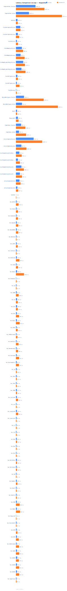
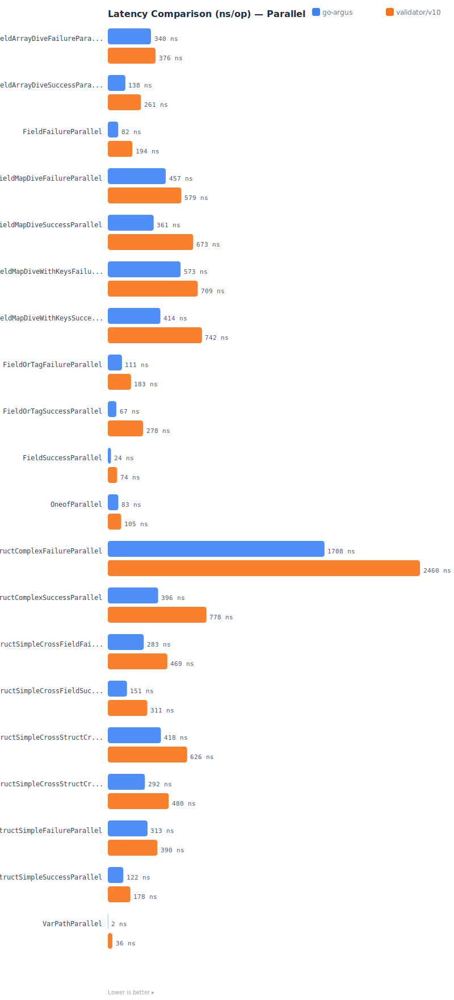
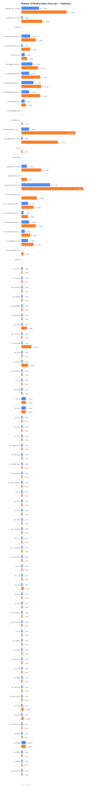

<div align="center">

# go-argus-benchmark

**[go-argus] 与 [go-playground/validator/v10] 的性能对比**

[go-argus]: https://github.com/kamalyes/go-argus
[go-playground/validator/v10]: https://github.com/go-playground/validator

[](https://github.com/kamalyes/go-argus-benchmark/actions/workflows/benchmark.yml)

[English](./README.md)

</div>

---

## 📊 性能对比图表

### 延迟 — 串行



### 延迟 — 并行



### 内存分配 — 串行



> 图表由 GitHub Actions 在每次推送时自动生成。

---

## 🚀 快速开始

```bash
# 运行所有基准测试
go test -run='^$' -bench=. -benchmem -count=3 -timeout=30m ./... | tee benchmark_output.txt

# 生成图表和报告
go run ./bootstrap/report

# 解析真实基准测试输出
go test -run='^$' -bench=. -benchmem -count=1 -timeout=10m ./... > benchmark_output.txt
go run ./bootstrap/report -parse benchmark_output.txt
```

---

## 📁 项目结构

```bash
go-argus-benchmark/
├── bench_alloc_test.go            # 主基准测试用例
├── benchmark_rules_test.go        # 规则级基准测试
├── models.go                      # 测试结构体模型
├── bootstrap/
│   └── report/
│       └── main.go                # 报告和 SVG 图表生成器
├── benchmarks/
│   ├── latency.svg                # 串行延迟图
│   ├── latency_parallel.svg       # 并行延迟图
│   ├── allocs.svg                 # 内存分配图
│   └── *.json                     # 原始基准数据
├── .github/workflows/
│   └── benchmark.yml              # CI 自动基准测试工作流
├── BENCHMARKS.md                  # 详细数据表格
└── go.mod
```

---

## ⚙️ CI 自动化

[benchmark 工作流](./.github/workflows/benchmark.yml) 在每次推送到 `main`/`master` 时自动运行：

1. 以 5 次迭代运行 `go test -bench`
2. 解析结果并生成 SVG 图表
3. 将更新的图表和 `BENCHMARKS.md` 提交回仓库

---

## 📋 完整数据

详见 [BENCHMARKS.md](./BENCHMARKS.md)，包含所有场景的详细对比数据表格。

---

## 📝 许可证

本项目采用 MIT 许可证。
